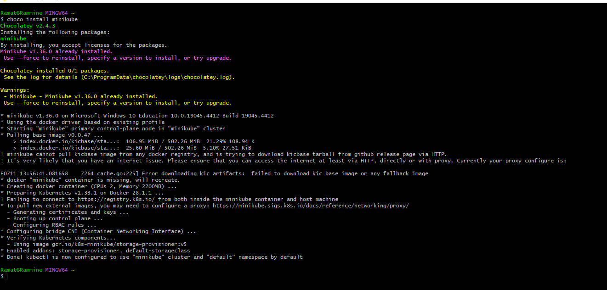

# kubernete
## Kubernete is an open-source container orchestration platform that automation the deployment, scaling and management of containerized applications. they are developed by google and later open-sourced

