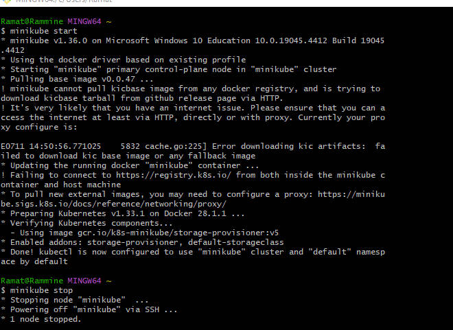
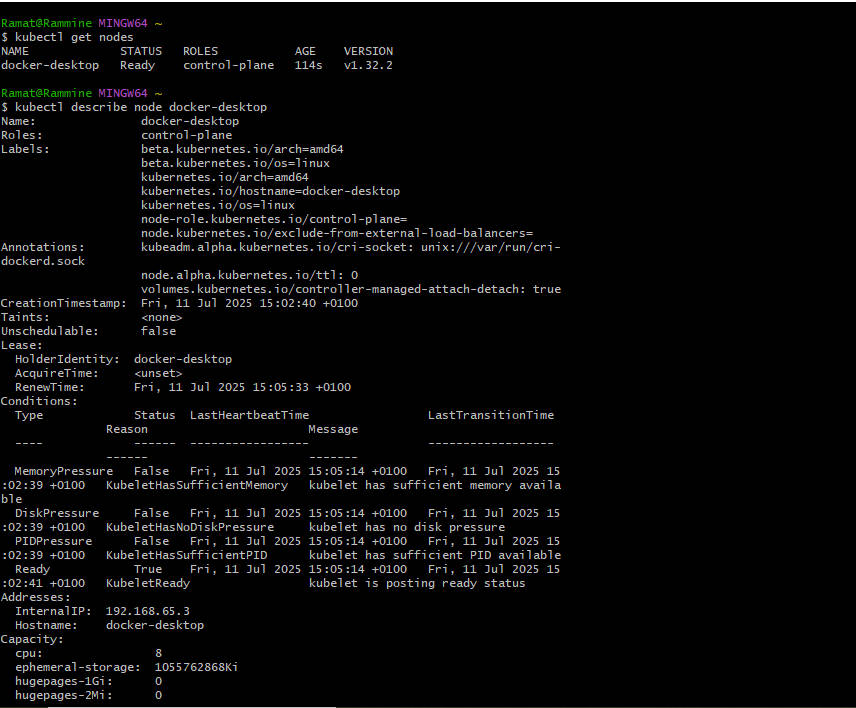
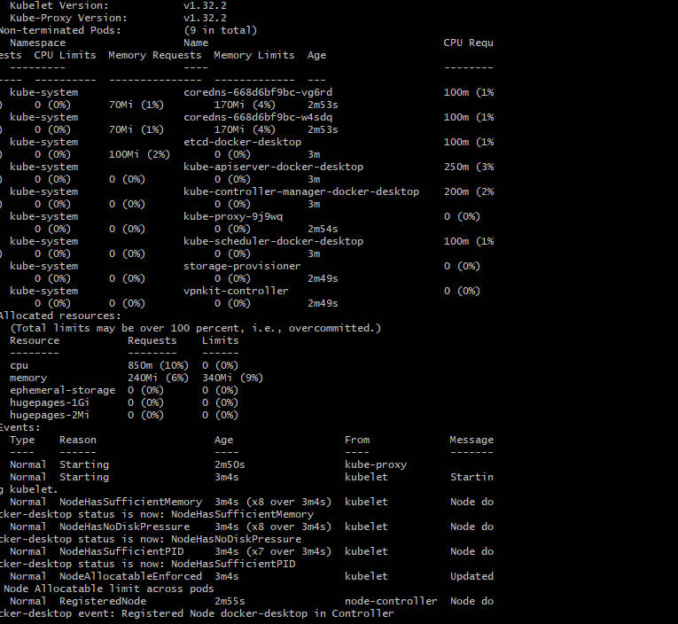
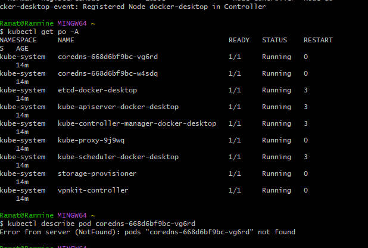
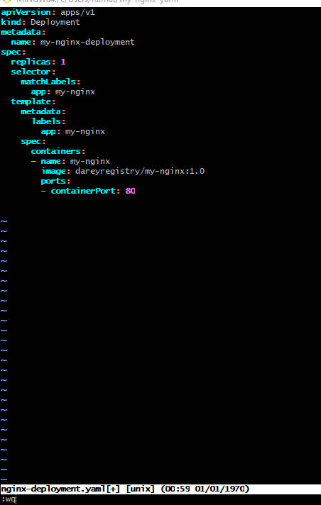
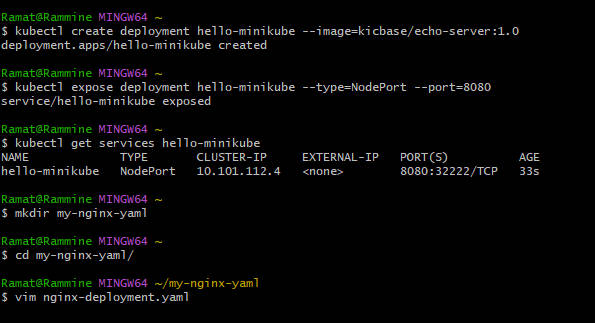
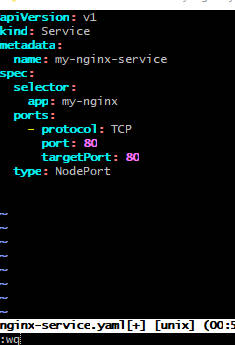
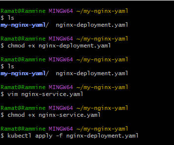
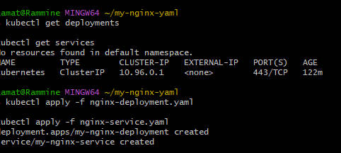
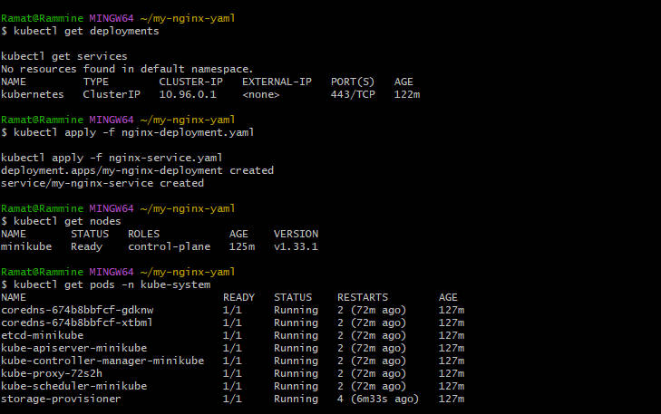

# kubernete
## Kubernete is an open-source container orchestration platform that automation the deployment, scaling and management of containerized applications. they are developed by google and later open-sourced.

## There are component of kubernete, they are 
- control plane
- node
- pods
- container
- API server
- etcd
- kubelet
- kube proxy
- controller manager
- scheduler

